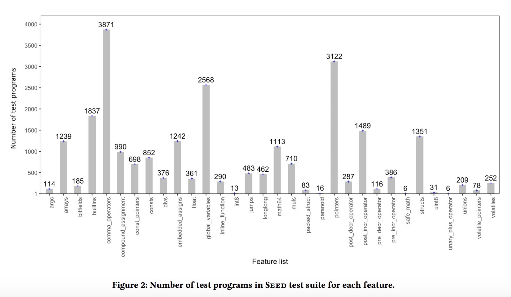
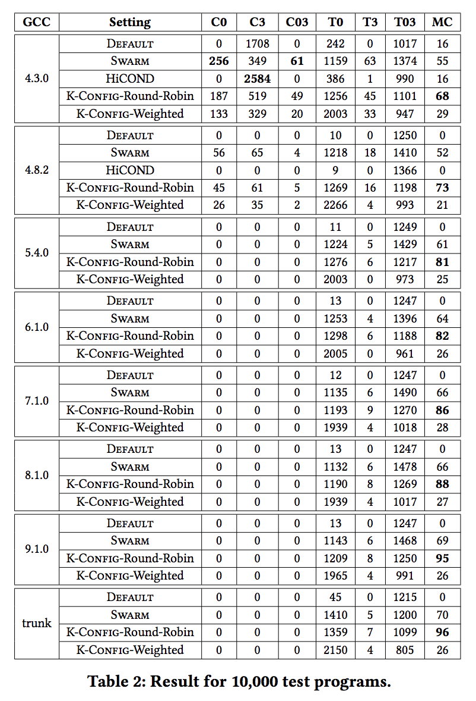
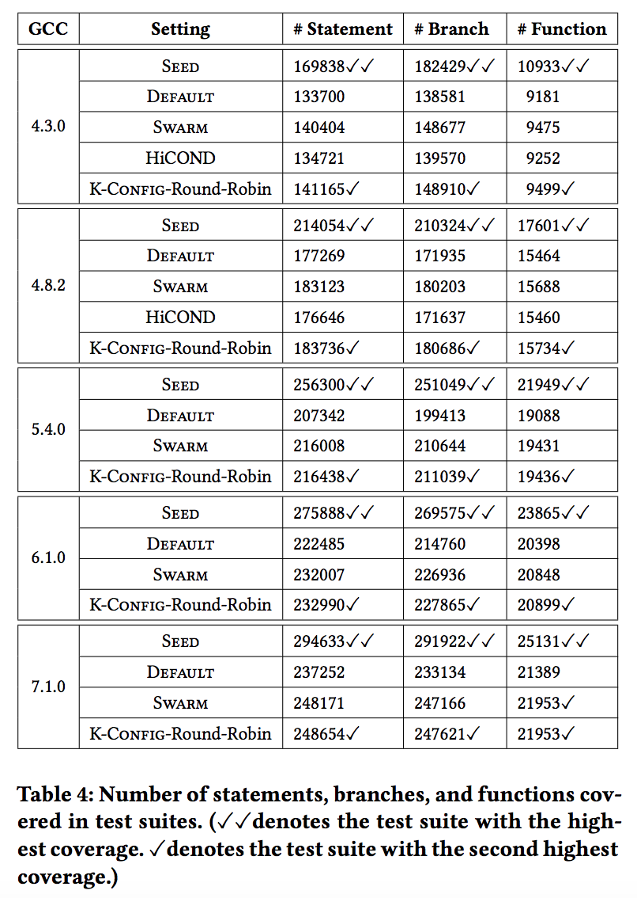

# K-Config

We introduce the K-Config approach that uses the code snippets in the bug reports to propose configurations for Csmith. More specifically, K-Config clusters the code snippets in the bug reports and uses the centroids of clusters as a basis for proposing configurations for Csmith. The reasoning it uses is that the code snippets in the bug reports that triggered bugs earlier are more likely to be of interest to developers. We have studied K-Config for GCC C compiler and Csmith test generator. 

This project contains the source code and dataset of the following papers on the K-Config approach:

- Initial Version:
  - K-CONFIG: Using Failing Test Cases to Generate Test Cases in GCC Compilers
  - [[ASE-LBR'19](https://2019.ase-conferences.org/track/ase-2019-Late-Breaking-Results)] [[arXiv](https://arxiv.org/abs/1908.10481)] [[GitHub](https://github.com/mdrafiqulrabin/kconfig/tree/master/aselbr19)]
- Final Version:
  - Configuring Test Generators using Bug Reports: A Case Study of GCC Compiler and Csmith
  - [[SAC-SVT'21](https://sites.google.com/view/svt2021)] [[arXiv](https://arxiv.org/abs/2012.10662)] [[GitHub](https://github.com/mdrafiqulrabin/kconfig/tree/master/sacsvt21)]

## Structure

```
├── aselbr19/     # Initial version (ASE-LBR'19) of K-Config.
├── images/       # some figures and tables from the paper for README.
├── legacy/       # Testsuite and additional analysis.
├── sacsvt21/     # Final version (SAC-SVT'21) of K-Config.
``` 

---

## Workflow:


---

## Seed Testsuite: [GCC Regression](https://github.com/mdrafiqulrabin/kconfig/blob/master/legacy/gcc-regression/c_files/gcc_regression_tc.txt)



---

## Results:

 

